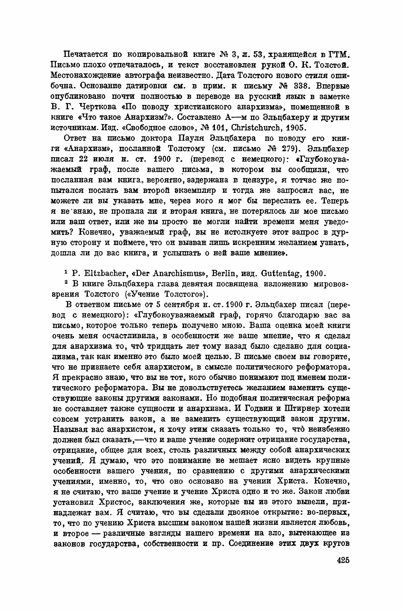
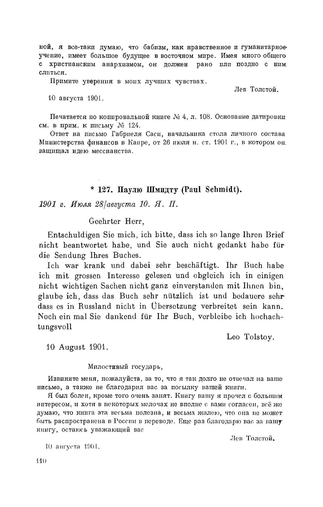

# Tolstoy and "Christian anarchism"

Date: 2026-05-30

Context: A narrow primary-source dive into how Leo Tolstoy engaged the label *anarchist* — and the compound *Christian anarchism* («христианский анархизм») — across the local corpus: the tolstoydigital TEI texts and the Jubilee Edition (PSS). It documents what his own voice does with the terms. It does not adjudicate whether the labels are accurate.

This is the second of three dives that split an earlier combined survey, [tolstoyanism-christian-anarchism](../tolstoyanism-christian-anarchism/index.html): dive #1 took *Tolstoyism* ([tolstoyanism](../tolstoyanism/index.html)); this is *Christian anarchism*; dive #3 took the bare label *Christian* ([christian](../christian/index.html)). The Christian-anarchism evidence was already extracted, byte-checked, and cross-read against the printed PSS in the combined survey; this dive reuses those locked extracts verbatim and adds the structured layers the original lacked — a machine-readable [dossier.yaml](dossier.yaml), an entity routing map, a scholarly-context layer, and a visual record. The combined survey is superseded for the Christian-anarchism half once this lands.

---

## 1. Key findings

- **The spine is a double move.** Tolstoy refuses *anarchist* as a **political** label and affirms the substance as **religious** — Christ's teaching. The two are not in tension for him: what Eltzbacher files under political science he files under the Gospel.
- **Eltzbacher (1900) — the rejection.** Answering the Berlin scholar who had just classified him as one of the seven principal anarchists, Tolstoy writes «я не анархист в смысле политического реформатора» ("I am not an anarchist in the sense of a political reformer") and turns Eltzbacher's **own index** into the proof: under "violence" the book cites every other thinker and not one page of Tolstoy — because Tolstoy wrote on non-resistance as religion, never on violence as politics.
- **Sacy (1901) — the unique self-attestation.** The 1901 letter to the Cairo Bábí Gabriel Sacy is the **only** place in the entire 90-volume Jubilee Edition where Tolstoy uses «христианский анархизм» / «l'anarchisme chrétien» in his own voice — and even there third-person: *Babism* "has much in common with Christian anarchism." It stops one step short of "I am a Christian anarchist."
- **The 1894 diary seed.** Six years before Eltzbacher made the question public, Tolstoy works out a reply to "the Englishman" on *how to be without government* by reframing it: the question is wrongly posed; the only real question for a person is whether to subordinate conscience to a violent state or withdraw it — an individual, religious answer, not a political programme.
- **The phrase was not his coinage.** «Христианский анархизм» was a term of art already circulating among his correspondents — Schmitt (Budapest), Kenworthy (Croydon), Davidson, Crosby (New York), Ortt (Netherlands) — through the 1890s, and given programmatic Russian form by V. G. Chertkov's 1905 booklet *O khristianskom anarkhizme*.
- **For the vault.** This dive anchors the existing `Christian Anarchism` page's flagged "NEEDS PRIMARY SOURCE" claim — Tolstoy's rejection of the political label — with the Eltzbacher letter, and supplies the Sacy self-attestation and the phrase-genealogy the page currently lacks. Ingestion is a separate, human step.

---

## 2. Why this matters

A reader who meets Tolstoy through twentieth-century commentary meets him already filed as a *Christian anarchist*. The category is genuinely useful — modern scholarship uses it as the standard description of his political thought — but it was fixed on him from outside, beginning with a book he praised and then politely declined to be claimed by. The question this dive answers is narrow and checkable: when *anarchist* and *Christian anarchism* appear in the corpus, **what does Tolstoy's own voice do with them?**

The answer is consistent. He treats the political label as a category error and redirects it, every time, to the Gospel; and the one occasion on which he uses the compound phrase himself, he holds it at arm's length, as the name of a doctrine he describes rather than a badge he wears. The three primary-voice moments below — a diary, two bilingual letters — are the whole of it, with a fourth, earlier diary entry as the seed and a circle of foreign correspondents as the context in which the phrase was actually born.

A companion file, [pss-volume-mapping.md](../pss-volume-mapping.md), resolves Tom-number citations to the local PDF paths under `primary-sources/jubilee-edition/`.

A note on dates: the pre-1918 Russian items follow the PSS, which dates by Old Style (Julian); where the source itself gives both, both are kept (e.g. the Eltzbacher letter, 1/13 August 1900).

---

## 3. The shape of the question

Three primary-voice moments form the spine, bracketed by an earlier diary entry that records the seed. Working English translations are the editor's; the Russian (and, in the two letters, Tolstoy's own French and German) is verbatim from the TEI extracts, byte-checked against the extract files by `verify_quotes.py` (see Method).

### 3.1 — 1894 (10 September): the seed

Diary entry at Yasnaya Polyana (PSS Tom 52, pp. 138–140; TEI `v52_138_140_1894_09_10`). On waking, Tolstoy notes the question he is turning over:

> Вчера утром, проснувшись, думал об ответе об анархизме, как быть без правительства, англичанину.

> *Yesterday morning, on waking, I was thinking about the answer about anarchism, how to be without government, to the Englishman.* (working English)

The worked-out reply that follows does not answer the question; it dissolves it. To ask how to organise a stateless society is, Tolstoy holds, to ask the wrong thing:

> Ответ не может быть дан на вопрос, потому что он дурно поставлен. Вопрос не в том — устроить государство: по нынешнему, или по новому. Я и никто из нас не приставлен к решению этого вопроса.

> *The answer cannot be given to the question, because it is badly posed. The question is not whether to arrange the state in the present way or in a new way. Neither I nor any of us is appointed to the solving of that question.* (working English)

What is left is not a political question but a personal one — the choice each person faces and cannot evade:

> подчинить ли свою совесть делам, совершающимся вокруг меня, признать ли себя солидарным с правительством, которое вешает заблудших людей, гонит на убийство солдат, развращает опиумом и водкой народ и т. п., или подчинить свои дела совести, т. е. не участвовать в правительстве, дела которого противны моему сознанию?

> *[the only question is] whether to subordinate my conscience to the deeds being done around me — to acknowledge myself in solidarity with a government that hangs erring men, drives soldiers to murder, debauches the people with opium and vodka, and so on — or to subordinate my deeds to my conscience, that is, not to take part in a government whose deeds are repugnant to my consciousness.* (working English)

This is the structural answer to "are you an anarchist," given privately in 1894 — six years before Eltzbacher's book made the question public. Tolstoy says he does not know and cannot know what political order would follow; he knows only what a person must *do*. Full extract: [extracts/v52_138_140_1894_09_10.txt](extracts/v52_138_140_1894_09_10.txt).

### 3.2 — 1900 (1/13 August): the rejection of "anarchist" as political

Letter to Paul Eltzbacher, written in German from Yasnaya Polyana (PSS Tom 72, letter 341, pp. 424–426; TEI `v72_341_PaulyuElcbaxeruPaulEltzhacher`). Eltzbacher (1868–1928), a Berlin legal scholar, had published *Der Anarchismus* (Berlin: Guttentag, 1900), a systematic study classifying seven thinkers as the principal exponents of anarchism — Godwin, Proudhon, Stirner, Bakunin, Kropotkin, Tucker, and Tolstoy — and had sent two copies. Tolstoy's reply opens with genuine praise:

> Ваша книга делает для анархизма то, что 30 лет назад было сделано для социализма: вводит его в программу политических наук. Ваша книга мне чрезвычайно понравилась. Она совершенно объективна, понятна, и, насколько я могу судить, источники в ней отлично использованы.

> *Your book does for anarchism what was done thirty years ago for socialism: it brings it into the programme of the political sciences. Your book pleased me exceedingly. It is entirely objective, intelligible, and — so far as I can judge — the sources in it are excellently handled.* (working English)

Then the turn — a qualified denial that refuses the label while accepting the substance, and re-names the substance:

> Мне кажется только, что я не анархист в смысле политического реформатора. В оглавлении вашей книги под словом «насилие» сделаны указания на разные страницы из других сочинений, но ни одной ссылки на мои. Не доказательство ли это того, что то учение, которое вы мне приписываете и которое, в сущности, есть не что иное, как учение Христа, вовсе не политическое, а религиозное учение?

> *It seems to me only that I am not an anarchist in the sense of a political reformer. In the index of your book under the word "violence" references are made to various pages of the other writers, but not one to mine. Is this not proof that the teaching which you ascribe to me, and which is, in essence, nothing other than the teaching of Christ, is not a political but a religious teaching?* (working English)

The index argument is the unusually pointed part: Tolstoy uses Eltzbacher's own bibliographic apparatus as the evidence. The book opens columns of references on *Gewalt* / violence for Bakunin and Kropotkin; for Tolstoy, none — because he had never written on violence as a political problem, only on non-resistance as a religious one. The letter is bilingual, German first; in Tolstoy's German hand the same sentence reads:

> Mir scheint nur, dass ich kein Anarchist bin im Sinne eines politischen Reformators. Im Register Ihres Buches beim Worte: «Zwang» sind verschiedene Seiten bei allen anderen angegeben, aber keine in meinen Schriften. Ist das nicht ein Beweis, dass die Lehre, die Sie mir zuschreiben, aber die eigentlich nur die Lehre Christi ist, keine politische aber eine religiöse Lehre ist?

(The German index word is «Zwang», coercion; Tolstoy's own Russian renders it «насилие», violence.) Full extract (German + Russian, both in Tolstoy's hand): [extracts/v72_341_PaulyuElcbaxeruPaulEltzhacher.txt](extracts/v72_341_PaulyuElcbaxeruPaulEltzhacher.txt). Printed page reproduced below (§7).

### 3.3 — 1901 (28 July / 10 August): the unique self-attestation

Letter to Gabriel Sacy, written in French from Yasnaya Polyana (PSS Tom 73, letter 126, pp. 109–110; TEI `v73_126_GabrielyuSasiGabrielSacy`). Gabriel Sacy (1858–1903) headed the personnel office at the Ministry of Finance in Cairo and was a Bábí — an adherent of the mid-nineteenth-century Persian messianic movement that would shortly split into Bábí and Baháʼí branches (the PSS calls him «бабист»; by 1901 he was himself moving toward the Baháʼí side). He had written defending the idea of messianism. Tolstoy replies that Babism, as a moral and humanitarian doctrine, has a great future in the East, and then:

> я все-таки думаю, что бабизм, как нравственное и гуманитарное учение, имеет большое будущее в восточном мире. Имея много общего с христианским анархизмом, он должен рано или поздно с ним слиться.

> *I still think that Babism, as a moral and humanitarian doctrine, has a great future in the eastern world. Having much in common with Christian anarchism, it must sooner or later merge with it.* (working English)

In Tolstoy's own French original:

> je crois tout de même que le Babisme comme doctrine morale et humanitaire a un grand avenir dans le monde oriental ayant beaucoup de rapports avec l’anarchisme chrétien et tôt ou tard doit s’unir à lui.

This is the only place in the entire 90-volume Jubilee Edition where Tolstoy uses the phrase «христианский анархизм» / «l'anarchisme chrétien» in his own voice. The phrasing is not "I am a Christian anarchist" but "Babism has much in common with Christian anarchism": he treats *Christian anarchism* as the name of an already-existing body of doctrine with which a renewed Eastern messianism may converge. The implication — that this is the doctrine he and his correspondents have been working on since the early 1890s — is unmistakable, but the explicit self-application stops one step short. Full extract (French + Russian, both in Tolstoy's hand): [extracts/v73_126_GabrielyuSasiGabrielSacy.txt](extracts/v73_126_GabrielyuSasiGabrielSacy.txt). Printed page reproduced below (§7).

---

## 4. Where the theme clusters in the Jubilee Edition

The keyword sweep behind the combined survey returned approximately **110 unique TEI files** for the anarchism family («анархизм» + «анархист» + «анархия» declensions). The compound phrase `христианский анарх[*]` (all five case-inflected adjective forms) returned **3 files**; only one — the Sacy letter — carries the phrase in Tolstoy's own voice. The maps below point to the clusters that reward reading; the full file-by-file hit list is preserved in the working zone `_generated/research/tolstoyanism-christian-anarchism/`.

### The body-voice spine

| PSS Tom / pp | TEI id | Date | Addressee | What it does |
| --- | --- | --- | --- | --- |
| Т.52, 138–140 | `v52_138_140_1894_09_10` | 1894-09-10 | diary | **The seed.** "How to be without government" reframed: the question is wrongly posed. |
| Т.72, 424–426 | `v72_341_…Elcbaxeru…` | 1900-08-01 | Paul Eltzbacher (letter) | **The rejection.** "Not an anarchist in the sense of a political reformer"; the index argument. |
| Т.73, 109–110 | `v73_126_…Sasi…` | 1901-07-28 | Gabriel Sacy (letter) | **The unique attestation** of «христианский анархизм» in Tolstoy's own voice. |

### Letters — the foreign Christian-anarchist correspondence

The circle in which the phrase actually circulated. These are the letters that give the genealogy its shape; two are extracted here (Davidson, Schmitt), the rest are pointers.

| PSS Tom, letter | Addressee, date | Material |
| --- | --- | --- |
| Т.67, letter 179 | John Morrison Davidson, 1894-07-23 | Programmatic: the socialist/communist/anarchist theories serve to corroborate the Christian truth, not the reverse. Extracted. |
| Т.68, letters 24, 60 | Eugen Heinrich Schmitt, 1895 | The Hungarian Christian-anarchist correspondence: «Ваше дело, наше дело, т. е. божье дело» ("Your work, our work, that is, God's work"). Extracted. |
| Т.67/69 (several) | John Coleman Kenworthy, 1894–1896 | The English Brotherhood Church (Croydon). |
| Т.69, letter 4 | Ernest Howard Crosby, 1896 | American Tolstoyan and translator (New York). |
| Т.72, letter 319 | Élisée Reclus, 1900-06-20 | The French anarchist geographer; brief (permission to translate *Resurrection*). |
| Т.72, letter 396 | Felix Ortt, 1900 | Dutch Christian-anarchist. |
| Т.78, letter 252 | Bishop Germogen, 1908-09-13 (unsent) | Reply to Germogen's calling him an "anathematised godless anarchist-revolutionary" — answered brother-to-brother, not on the political term. Extracted. |
| Т.82, letter 178 | M. K. Gandhi, 1910-09-07 | "Anarchism" appears only in a list of symptoms of the inner contradiction of Christian civilisation — a context word, not self-application. |

### Polemical works — the doctrinal grounding

| PSS Tom | Work | Note |
| --- | --- | --- |
| Т.28 | *The Kingdom of God Is Within You* (1893) | The major polemical work of the period — the book Eltzbacher classified from. English text at `primary-sources/standard-ebooks/…the-kingdom-of-god-is-within-you…`. |
| Т.25 | *What Then Must We Do?* (1886) | Pre-Eltzbacher; the economic-religious foundations. |
| Т.34 | *The Slavery of Our Time* (1900) | Companion to the Eltzbacher exchange. |
| Т.35 | *What Is Religion…* (1902); *To Political Activists* (1903) | Re-grounds the political question in religious terms. |
| Т.36 | *On the Meaning of the Russian Revolution* (1906) | Post-1905. |

### The genealogy of the phrase «христианский анархизм»

The Sacy letter shows the phrase already in Tolstoy's working vocabulary by 1901, but it was not his coinage. It was a term of art that had emerged among his correspondents — Schmitt, Kenworthy, Davidson, Crosby, Ortt — through the 1890s. By 1905 V. G. Chertkov had given it programmatic Russian form in the booklet *O khristianskom anarkhizme* (Christchurch: *Свободное слово*), and the editorial apparatus to the Eltzbacher letter (PSS Tom 72) cites that very booklet as the prior place of partial publication of the letter — so the documentary chain from Tolstoy's correspondence to Chertkov's framing is real, not merely thematic. When the phrase stabilised as a doxographic category in twentieth-century political theory is a separate question, taken up in §5.

---

## 5. Scholarly context

The conventional scholarly picture and the corpus agree on the substance; the corpus sharpens the question of the *label*.

Modern scholarship treats Tolstoy as the founding and most influential exponent of *Christian anarchism* (or *Christian anarcho-pacifism*) — and is generally careful to note that the description is the scholarship's, not his. Alexandre Christoyannopoulos's *Christian Anarchism: A Political Commentary on the Gospel* (Imprint Academic, 2010), with his *Tolstoy's Political Thought* (Routledge), is the fullest treatment, and uses the label explicitly while acknowledging that Tolstoy avoided it. The classification itself goes back to the document at the centre of this dive: Eltzbacher's *Der Anarchismus* (1900) canonised Tolstoy as one of seven anarchist "sages," and that canon has largely held in the general histories (Peter Marshall's *Demanding the Impossible*, 1992, keeps the chapter). On the substance, then, the corpus **confirms** the received view: Tolstoy is read as subordinating socialist, communist and anarchist theory to the Gospel, which is exactly the hierarchy the 1894 Davidson letter states (§4).

Where the corpus pushes is on the gap between the external label and Tolstoy's own voice. The standard accounts explain his reticence by the label's association with political violence — Marshall writes that he "did not publicly call himself an anarchist because of that title's associations with violence," and Brian Morris frames it the same way. The Eltzbacher letter **complicates** that: the refusal is more precise than a recoil from violence. Tolstoy accepts the factual observation that he never wrote on violence as a political problem and turns it into the proof — via the silence of Eltzbacher's own index under "violence" — that his teaching is religious, not political. That index argument is not noted in the secondary literature this sweep reached. And the Sacy letter **extends** the scholarship at a point it usually only gestures at. Studies routinely observe that Tolstoy "avoided the term"; the corpus supplies the single, datable exception — the one place in ninety volumes where he uses «христианский анархизм» himself — and shows even that to be third-person and provisional. The 1894 diary likewise **extends** the usual chronology, which dates his anti-state position to *The Kingdom of God* (1893) and the 1900s essays: the structural "how to be without government" answer is already worked out, privately, in the diary.

On the genealogy, the scholarship and the corpus agree that the phrase was a movement's before it was Tolstoy's. Charlotte Alston's *Tolstoy and His Disciples* (I.B. Tauris, 2013) maps the international circle — Schmitt in Budapest, Kenworthy in Croydon, Crosby in New York, Ortt in the Netherlands — through which "Christian anarchism" travelled in the 1890s, and Chertkov's 1905 booklet is the in-circle consolidation the Sacy phrase points back to. One widely-repeated claim does **not** survive the sweep: that "Christian anarchism" was coined by reviewers of *The Kingdom of God Is Within You* in 1894. It is uncited in the secondary literature — and in the vault's own draft page, which flags it as needing a source — and the corpus points instead to the correspondent circle (Schmitt's *Ohne Staat* journal, Kenworthy's Brotherhood Church) as the term's working source.

*(This section is drafted from standard scholarship and a light web sweep; secondary claims are attributed, not asserted, and listed in §9. The primary quotations alone carry byte-fidelity; see [dossier.yaml](dossier.yaml) `scholarship`.)*

---

## 6. Material not covered

- **Chertkov's 1905 booklet *O khristianskom anarkhizme*** — the in-circle programmatic frame the Sacy phrase points to; not held locally.
- **Incoming letters** — Eltzbacher's, Sacy's, and Schmitt's letters *to* Tolstoy. The TEI corpus holds only outgoing letters.
- **The Kingdom of God Is Within You (Т.28)** — the doctrinal work Eltzbacher classified from. A Tolstoy *work* (handled in `works/`, not a wiki entity), referenced here but not re-extracted.
- **The broader anti-state corpus** — *On Anarchy* / «Об анархии», *The Slavery of Our Time* (Т.34), *To Political Activists* (Т.35), and the post-1905 political essays — engages the *state* and *non-resistance* rather than the *label*; left to a separate dive.
- **The Goldenweiser / Makovický conversation transcripts** — spoken-voice remarks; not swept.
- **Eltzbacher back-correspondence** — there is no 1910 second edition (the catalogued *2. Auflage* is the posthumous 1987 Roemheld edition); PSS Tom 72 prints Eltzbacher's reply. A resolved negative result.
- **"Thirty years earlier for socialism"** (the Eltzbacher letter's opening) — a generic gesture to German academic socialism of c.1870; no specific 1870 work is identified.

---

## 7. Visual & manuscript record

The dive is text-first; the visual record is light. The two page facsimiles below are committed (they are public-domain renderings we make ourselves from the local PSS PDFs); the portraits are downloaded into the git-ignored `visuals/` cache (repopulate a fresh clone with `python3 docs/fetch_visuals.py christian-anarchism`). Provenance, holding and rights for every item are in [dossier.yaml](dossier.yaml).

<figure>

<figcaption>The rejection. PSS Tom 72 (local <code>vol36</code>), the page of the 1/13 August 1900 letter to Paul Eltzbacher carrying «…я не анархист в смысле политического реформатора…». Rendered at 220 dpi from the local public-domain PSS PDF (<code>extracts/pss-pages/tom72-eltzbacher-442.png</code>).</figcaption>
</figure>

<figure>

<figcaption>The unique attestation. PSS Tom 73 (local <code>vol37</code>), the page of the 28 July / 10 August 1901 letter to Gabriel Sacy carrying «…имея много общего с христианским анархизмом…». Rendered at 220 dpi from the local public-domain PSS PDF (<code>extracts/pss-pages/tom73-sacy-154.png</code>).</figcaption>
</figure>

<figure>

<figcaption>Paul Eltzbacher (1868–1928), the Berlin legal scholar whose <em>Der Anarchismus</em> (1900) classified Tolstoy among the seven principal anarchists. Wikimedia Commons, public domain (<em>File:Paul Eltzbacher.jpg</em>).</figcaption>
</figure>

<figure>

<figcaption>Eugen Heinrich (Jenő) Schmitt (1851–1916), the Budapest philosopher and node of the foreign Christian-anarchist correspondence. Wikimedia Commons, public domain (<em>File:Schmitt Jenő.jpg</em>).</figcaption>
</figure>

<figure>

<figcaption>Vladimir Chertkov, by Ilya Repin (1890s) — Tolstoy's disciple and publisher, who gave «христианский анархизм» programmatic Russian form in the 1905 booklet <em>O khristianskom anarkhizme</em>. Wikimedia Commons, public domain (<em>File:Repin Vladimir Chertkov.jpg</em>).</figcaption>
</figure>

**Not openly available.** No portrait of **Gabriel Sacy** could be found (Wikimedia Commons returns only the unrelated orientalist Silvestre de Sacy); it would need an Egyptian or Russian-archive request. Manuscript facsimiles of the letters (beyond the printed PSS pages) and Russian-museum holdings (State Museum of Leo Tolstoy / GMT) were not pursued in this light sweep. All three primary texts map to held local PSS PDFs (Toms 52→`vol18`, 67→`vol33`, 68→`vol34`, 72→`vol36`, 73→`vol37`), so further facsimiles can be rendered locally without a request (the `vol18/33/34` mappings are inferred from the publication-order convention and should be confirmed against [pss-volume-mapping.md](../pss-volume-mapping.md)).

---

## 8. Method

- **Scope (Phase 0 contract, as confirmed).** A fresh, narrow dive at `docs/research/christian-anarchism/` that **reuses** the byte-faithful Christian-anarchism extracts from the legacy combined survey rather than re-sweeping. Spine: Tolstoy's double move (refuse the political label / affirm the religious substance) across the Eltzbacher and Sacy letters, with the 1894 diary as seed and the phrase-genealogy as a parallel thread. Corpus surface: post-1880 "Prophet" period, letters first-class, diaries and the polemical works (esp. *The Kingdom of God*, Т.28) secondary, editorial `comments/` excluded from evidence. Sweep mode: inline (the heavy sweep was already done). Visuals: light.
- **Reuse, not re-derive (retrofit mode).** Per the corpus-dive "retrofit" path, the combined survey's prose and translations are treated as locked Phase-2 output. The extracts (`v52_…`, `v72_…`, `v73_…`, plus the supporting `v67_…` Davidson and `v68_…` Schmitt) and the rendered PSS page images were copied into this dive's `extracts/`.
- **Extract & verify (Phase 2).** Every `quoteRu` in [dossier.yaml](dossier.yaml) was **sliced directly from the extract files by a fail-loud script** (start/end anchors; never hand-typed), then gated by [`verify_quotes.py`](../lib/verify_quotes.py), which asserts each quote appears verbatim in its named extract — **PASS, 10/10 verbatim, 2 facsimiles present, exit 0**. The Eltzbacher and Sacy pages are committed PD facsimiles rendered with `pdftoppm` at 220 dpi. The two bilingual letters are entered twice — Tolstoy's Russian and his own French/German original — both byte-checked.
- **Scholarship (Phase 3).** A light, English-first web sweep established the received view (Christoyannopoulos 2009/2010; Alston 2013; Eltzbacher 1900 / Byington trans. 1908; Marshall) and is triangulated in §5 and recorded in `dossier.yaml` under `scholarship` — attributed, not asserted; no byte-fidelity is claimed for secondary sources.
- **Dates** follow the PSS (Old Style for the pre-1918 items; both styles where the source gives both). The TEI filename encodes the PSS Tom and, for the diary, the entry date, so every citation is anchored to its source. Tom→local-PDF lookups are in [pss-volume-mapping.md](../pss-volume-mapping.md).

---

## 9. References

**Primary:**

- Толстой Л. Н. *Полное собрание сочинений: в 90 тт.* — М.: Гос. изд. «Художественная литература», 1928–1958 (PSS, the Jubilee Edition; local copies at `primary-sources/jubilee-edition/`). Christian-anarchism material concentrated in Toms 52 (diary), 67, 68, 72, 73 (letters), and 28 (*The Kingdom of God Is Within You*).
- tolstoydigital TEI corpus, *Слово Толстого* project, HSE Moscow. CC BY-SA. <https://github.com/tolstoydigital/TEI> (local copy at `primary-sources/tolstoydigital-TEI/`).

**Background:**

- Eltzbacher, Paul. *Der Anarchismus.* Berlin: J. Guttentag, 1900 — the book that classified Tolstoy among the seven principal anarchists and prompted the 1900 letter. English trans. Steven T. Byington, *Anarchism: Exponents of the Anarchistic Philosophy* (New York: Benjamin R. Tucker, 1908).
- Christoyannopoulos, Alexandre. *Christian Anarchism: A Political Commentary on the Gospel.* Exeter: Imprint Academic, 2010 — the fullest treatment; uses the label while noting Tolstoy avoided it.
- Christoyannopoulos, Alexandre. *Tolstoy's Political Thought: Christian Anarcho-Pacifist Iconoclasm Then and Now.* London: Routledge (BASEES series) — systematises Tolstoy's political thought under the label. (Publication year unsettled — see [dossier.yaml](dossier.yaml) `needsReview`.)
- Marshall, Peter. *Demanding the Impossible: A History of Anarchism.* London: HarperCollins, 1992 — the standard general history; ch. "Leo Tolstoy: The Count of Peace."
- Morris, Brian. "Tolstoy and Anarchism" (The Anarchist Library) — "a religious form of anarchism."
- Hopton, Terry. "Tolstoy, God and Anarchism." *Anarchist Studies* 8, no. 1 (2000): 27–52.
- Alston, Charlotte. *Tolstoy and His Disciples: The History of a Radical International Movement.* London: I.B. Tauris, 2013 — maps the international circle (Schmitt, Kenworthy, Crosby, Ortt) in which the phrase circulated.
- Chertkov, V. G. *O khristianskom anarkhizme.* Christchurch: Свободное слово, 1905 — the in-circle programmatic statement that gave «христианский анархизм» consolidated Russian form (so titled in the PSS Tom 72 apparatus; see dossier `needsReview` on a possible alternate title). Not held locally.

**Companion documents:**

- [dossier.yaml](dossier.yaml) — the machine-readable evidence / entity / visuals / scholarship ledger behind this index.
- [extract_tei.py](../lib/extract_tei.py), [verify_quotes.py](../lib/verify_quotes.py) — the shared TEI extractor and the byte-fidelity gate.
- [tolstoyanism](../tolstoyanism/index.html) — dive #1 (*Tolstoyism*), the sibling whose structure this follows.
- [christian](../christian/index.html) — dive #3 (*Christian*).
- [christian-communism-socialism](../christian-communism-socialism/index.html) — the companion survey on the *Christian socialism* / *Christian communism* labels.
- [tolstoyanism-christian-anarchism](../tolstoyanism-christian-anarchism/index.html) — the legacy combined survey this dive supersedes for the *Christian anarchism* half.
- [pss-volume-mapping.md](../pss-volume-mapping.md) — Tom number → local PDF lookup.

---

*Dev-blog note (draft):* `website/src/posts/notes/2026-05-30-christian-anarchism.md` — a short recap of this dive, kept `draft: true` until published.
