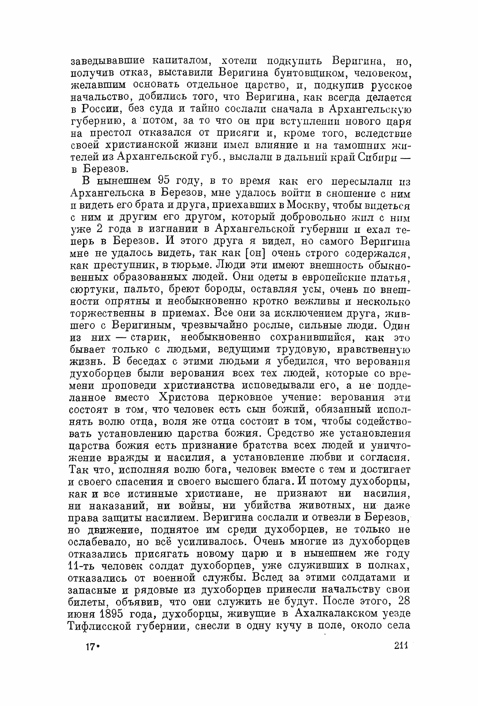

# Tolstoy and the Doukhobors

Date: 2026-05-26

Context: A survey of where Leo Tolstoy speaks about the Doukhobors — the pacifist Christian sect of the Transcaucasus whose mass refusal of military service in 1895 he made into the central public cause of his late life — across the 90-volume Jubilee Edition (PSS) and the structured TEI/XML corpus derived from it. The survey traces the conversation with the authorities, the letters to the Doukhobors themselves and to their leader Pyotr Verigin, the letters to sympathisers and helpers (Quakers, Aylmer Maude, Chertkov), the polemical articles, and the relief and emigration campaign that ended with ~7,400 Doukhobors resettled in Canada. It pays particular attention to whether — and how — P. I. Biryukov's authorised biography of Tolstoy treats the affair, and compares the primary record with the conventional scholarship available on the web.

It follows the method and house style of the companion survey [Tolstoy on copyright and the renunciation of literary property](../copyright-renunciation/index.md). The two topics meet at one decisive point: in 1898 Tolstoy broke his 1891 renunciation of copyright on exactly one work — *Resurrection* — in order to give its proceeds to the Doukhobor emigration. The Doukhobor cause is the reason the copyright renunciation has an exception.

---

## 1. Key findings

- **The largest sustained piece of *practical* moral action in Tolstoy's life.** The Doukhobor affair is where his doctrine of non-resistance stopped being a body of writing and became an organised rescue — some **~7,400** Doukhobors resettled in Canada in 1899, after the 1895 Burning of Arms and the state's reprisals.
- **The spine of the record:** the 1895 Burning of Arms and the open letter to the foreign press; the afterwords (to Biryukov's "Persecution of Christians" article and to the appeal «Помогите!» / "Help!"); the correspondence with the exiled leader Pyotr Verigin and with the relief circle (Chertkov, Biryukov, Tregubov, Maude, Sulerzhitsky); and the 1898–99 emigration logistics.
- **The copyright link.** In 1898 Tolstoy broke his 1891 copyright renunciation for exactly one work — *Resurrection* — to fund the emigration. The Doukhobor cause is the reason that renunciation has an exception.
- **The popular shorthand is true in spirit but loose in fact.** "Tolstoy sold *Resurrection* to pay the passage" overstates the proportion: his *Resurrection*-derived contribution (~30,000 roubles, "about half" the committee's fund) was one of three comparable streams, alongside the English Quakers and the Doukhobors' own pooled savings.
- **The primary record is harder than the heroic narrative.** It preserves Tolstoy's own misgiving that money may have been the wrong instrument, the 1900 letter to Canada that reads as a doctrinal *rebuke* rather than a celebration, and his late warnings against property and the cult of Verigin. His writing is also the fullest contemporary catalogue of *how the Russian state* met the sect.
- **On Biryukov.** The Jubilee Edition does not contain his biography, but it carries Tolstoy's afterword to Biryukov's 1895 article; Biryukov treats the Doukhobors substantially in Volume III (chapters 18, 19, 21), translated alongside this dive.
- **For the vault.** Anchors the non-resistance, refusal-of-military-service, and copyright-renunciation pages, and the Chertkov / Biryukov / Maude / Verigin circle. Ingestion is a separate, human step.

---

## 2. Why this matters for tolstoy.life

The Doukhobor affair is the largest sustained piece of *practical* moral action in Tolstoy's life — the place where his doctrine of non-resistance stopped being a body of writing and became an organised rescue of several thousand people. It draws together threads that the wiki tracks separately: non-resistance and refusal of military service; the renunciation of property and of copyright; the circle of disciples (Chertkov, Biryukov, Tregubov, Maude, Sulerzhitsky) who carried the work; the conflict with the church and the state; and Tolstoy's relations with the English Quakers and the wider international peace movement.

It is also a topic where the popular narrative ("Tolstoy wrote *Resurrection* to pay for the Doukhobors to sail to Canada") is true in spirit but loose in fact, and where the primary record is rich enough to correct it. This document is one focused sweep across that record, organised so a future session — by the project, a contributor, or anyone else — can pick up where this one stops. A companion file, [pss-volume-mapping.md](../pss-volume-mapping.md), resolves Tom-number citations to the local PDF paths under `primary-sources/jubilee-edition/`.

**A note on names and dates.** *Doukhobors* (Russian Духоборы / духоборцы, "Spirit-wrestlers") is the conventional English spelling; the Jubilee Edition uses духоборы. The leader is Pyotr Vasilevich Verigin (Пётр Веригин). Dates in the Jubilee Edition's datelines are Old Style (Julian); the Russian Empire ran 12 days behind the Gregorian calendar in the 1890s. Where a date matters, both styles are given (e.g. the Burning of Arms, 28–29 June 1895 OS = 10–11 July 1895 NS).

---

## 3. The shape of the question in Tolstoy's life

### 3.1. The Doukhobors before 1895 — who they were

The Doukhobors were a Russian peasant sect, rationalist and anti-clerical, that rejected the Orthodox church, icons, the priesthood, oaths, and the authority of the state over conscience. Persecuted and exiled to the Transcaucasus early in the nineteenth century, they had prospered there as a sober, literate, communal people — by the 1890s about 20,000 in the Tiflis, Kars and Elisavetpol provinces. Tolstoy gives this background himself, in the open letter of August 1895 (PSS Tom 39, pp. 209–215):

> С духоборцами случилось то, что обыкновенно случается с замыкающимися в самих себя и вследствие того процветающими религиозными общинами: материальное благосостояние их увеличивается, но религиозное сознание понижается.

> *What happened with the Doukhobors is what usually happens with religious communities that close in upon themselves and prosper as a result: their material well-being increases, but their religious consciousness declines.*

The revival came after the death of their leader Lukerya Kalmykova; the young Pyotr Verigin, chosen to head the community, refused to be bought by the elders who had been mismanaging its common funds, was denounced as a rebel, and was exiled without trial — first to Arkhangelsk province, then deeper into Siberia. From exile Verigin urged the community back to a literal Christianity: no oaths, no military service, no killing.

### 3.2. The Burning of Arms — 28–29 June 1895 (OS)

On the night of 28–29 June 1895 (OS) — timed to St Peter's Day — the Verigin party, some 7,000 people, gathered every weapon they owned, heaped it on kerosene-soaked pyres in three districts of the Transcaucasus, set it alight, and sang psalms through the night. It was a deliberate, coordinated renunciation of arms by a whole community. The state answered with Cossacks, floggings, the billeting of troops on the villages, and the dispersal of some 4,000 people, without land, into Georgian villages where many died over the following years.

Tolstoy's fullest narration of the event is in the open letter of 2/14 August 1895 (PSS Tom 39, pp. 209–215):

> После этого, 28 июня 1895 года, духоборцы, живущие в Ахалкалакском уезде Тифлисской губернии, снесли в одну кучу в поле, около села Спасского, всё свое имевшееся у них оружие и, обложив его дровами и углем и облив керосином, сожгли, показав этим, что не только некоторые лица из их общины, но все они отказываются от защиты своей собственности и самих себя оружием.

> *After this, on 28 June 1895, the Doukhobors living in the Akhalkalaki district of the Tiflis province carried all the weapons they had into a single heap in a field near the village of Spasskoye and, having piled wood and coal upon them and doused them with kerosene, burned them — showing thereby that not merely certain individuals of their community but all of them renounce the defence of their property and of themselves by arms.*

<figure>

<figcaption>The keystone passage as printed in the Jubilee Edition: PSS Tom 39, p. 209 (local vol. 8), the account of the Burning of Arms, rendered at 220 dpi from the public-domain PSS volume.</figcaption>
</figure>

The same letter records the scene at Kars, where the authorities tried to break the resisters with a mock execution:

> Тогда начальство построило виселицу, сшило саваны и со всею торжественностью, употребляющейся в казнях, вывело отказавшихся духоборов к казни… Они отвечали, что не будут, и попросили только позволения помолиться. Когда они кончили молитву, на них надели саваны, но, увидав их непреклонность и не имея еще разрешения свыше о предании их смертной казни, должны были снять с них саваны и признать себя побежденными.

> *Then the authorities built a gallows, sewed shrouds, and with all the solemnity used in executions led the refusing Doukhobors out to die… They answered that they would not serve, and asked only to be allowed to pray. When they had finished praying, the shrouds were put on them; but, seeing their steadfastness, and not yet having permission from above to put them to death, the authorities had to take the shrouds off them and acknowledge themselves defeated.*

Full extract: [extracts/v39_209_215_Pismo_v_inostrannye_gazety_po_povodu_gonenij_na_kavkazskih_duhoborov.txt](extracts/v39_209_215_Pismo_v_inostrannye_gazety_po_povodu_gonenij_na_kavkazskih_duhoborov.txt).

### 3.3. 1895 — Tolstoy takes up the cause

News reached Tolstoy through the exiled Prince D. A. Khilkov. The diary for 5 August 1895 (NS) records that he has drafted a letter to the English papers and is awaiting Biryukov's return from the Caucasus, where he had been sent to verify the facts (PSS Tom 53). Two documents follow within weeks.

**The open letter to the foreign newspapers** (2/14 August 1895; PSS Tom 39, pp. 209–215) is the foundational factual account — the Burning of Arms, the Verigin backstory, the Kars gallows, and the ruin of "400 families." Tolstoy explains why he must turn to the foreign press rather than the authorities or the Russian press:

> Обратиться прямо к лицам, творящим зло, я не могу… потому что их слишком много, начиная от царя… до последнего казака, воображающего, что, разоряя, оскорбляя, побивая своего брата духоборца, он не только не делает зло, но поступает хорошо, исполняя присягу.

> *I cannot turn directly to the persons doing the evil… because there are too many of them, beginning with the Tsar… down to the last Cossack, who imagines that in ruining, insulting, and beating his Doukhobor brother he is not only doing no evil but acting well, in fulfilment of his oath.*

**The afterword to Biryukov's article "The Persecution of Christians in Russia in 1895"** (19 September / 1 October 1895; PSS Tom 39, pp. 99–105) is the doctrinal companion. Here Tolstoy argues that the government cannot win the contest whatever it does — cruelty drives men away from it, leniency lets the example spread — and closes with the image that recurs through all his Doukhobor writing, the fire that cannot be smothered:

> Сколько бы ни набрасывали на горящую кучу хвороста дров, думая этим затушить огонь, — огонь, непотухающий огонь истины, только на время приглохнет, но разгорится еще сильнее и сожжет всё то, что наложено на него.

> *However much firewood is thrown onto the burning heap of brush in the hope of putting the fire out, the fire — the unquenchable fire of truth — will only die down for a time, then blaze up the more strongly and burn everything that has been piled upon it.*

> Еще одно небольшое усилие, и галилеянин победит, но не в том ужасном смысле, в котором приписывал ему победу языческий царь, а в том истинном смысле, в котором он про себя сказал, что победил мир.

> *One more small effort, and the Galilean will conquer — not in the terrible sense in which the pagan emperor [Julian] ascribed victory to him, but in the true sense in which he said of himself that he had overcome the world.*

This is the article by Biryukov to which Tolstoy attached his afterword — the first of two points at which Biryukov's name is woven directly into the Jubilee Edition's Doukhobor texts (see §5). Full extracts: [afterword to Biryukov's article](extracts/v39_099_105_Posleslovie_k_state_P_I_Birjukova_Gonenie_na_hristian_v_Rossii_v_1895_g.txt); the foreign-papers letter, above.

Tolstoy also opened a correspondence with Verigin himself. The **first letter to Verigin** (21 November 1895; PSS Tom 68, letter 229, pp. 262–266), prompted by a letter Verigin had sent to Tregubov, is a meditation on Verigin's claim that the living spoken word is superior to the dead book — Tolstoy, the writer, half-agreeing and half-defending the printed word as the one weapon the friends of truth cannot leave to its enemies. It opens "Дорогой брат!" ("Dear brother!") and closes "Братски обнимаю вас" ("I embrace you as a brother"). Full extract: [extracts/v68_229_P_V_Veriginu.txt](extracts/v68_229_P_V_Veriginu.txt).

### 3.4. 1896 — "Help!" and the exile of the three

In 1896 three of Tolstoy's closest disciples — V. G. Chertkov, P. I. Biryukov, and I. M. Tregubov — compiled and signed the appeal **«Помогите!»** ("Help!"), a documented account of the persecution addressed to Russian and international society. Tolstoy wrote the afterword (14/26 December 1896; PSS Tom 39, pp. 192–196). It is the most exalted of all his Doukhobor statements — the place where he names them not as a sect but as the seed of Christianity itself:

> Среди духоборов, или, скорее, христианского всемирного братства, как они теперь называют себя, происходит ведь не что-нибудь новое, а только произрастание того семени, которое посеяно Христом 1800 лет тому назад, — воскресение самого Христа.

> *Among the Doukhobors — or rather the universal Christian brotherhood, as they now call themselves — what is taking place is nothing new, but only the sprouting of that seed which was sown by Christ 1,800 years ago: the resurrection of Christ himself.*

The state's answer fell on the authors, not on Tolstoy: Biryukov and Tregubov were exiled to the Baltic provinces, and Chertkov was given the choice between internal exile and expulsion abroad. He chose England — from where, with freedom to publish and organise, he became the hub of the relief effort. Full extract: [extracts/v39_192_196_Posleslovie_k_vozzvaniju_Pomogite.txt](extracts/v39_192_196_Posleslovie_k_vozzvaniju_Pomogite.txt).

### 3.5. 1897–1898 — the campaign, and the decision to sell *Resurrection*

By 1897 Tolstoy had concluded that the community could not survive in Russia and that emigration was the only escape. The diary tracks the shift from protest to logistics: on 5 January 1897 he reads N. Nakashidze's account of the Doukhobor self-governing assembly at Gori and calls it "a model of the possibility of governance without violence" (PSS Tom 53).

Two articles of 1898 carry the public argument. **"Two Wars"** (Две войны, 15/27 August 1898; PSS Tom 31, pp. 97–101) sets the Spanish-American war of that year against the Doukhobors' resistance:

> Одна, теперь уж кончившаяся, была старая, тщеславная, глупая и жестокая, несвоевременная, отсталая, языческая война, — испанско-американская… Другая война… это новая, самоотверженная, основанная на одной любви и разуме, святая война, — война против войны… которую с особенной силой и успехом ведет в последнее время горсть людей — христиан, кавказских духоборов, против могущественного русского правительства.

> *The one, now already ended, was an old, vainglorious, foolish, and cruel war — untimely, backward, pagan — the Spanish-American war… The other war… is a new, self-sacrificing, holy war, founded on love and reason alone — the war against war… which of late has been waged with particular force and success by a handful of people — Christians, the Caucasian Doukhobors — against the mighty Russian government.*

**"Carthago delenda est"** (1898; PSS Tom 39, pp. 197–205) extends the case against military service. Full extracts: [Two Wars](extracts/v31_097_101_Dve_vojny.txt); [Carthago delenda est](extracts/v39_197_205_Carthago_delenda_est.txt).

The financial turn is recorded in the diary for **17 July 1898** (PSS Tom 53): the decision to give his novels *Resurrection* and *Father Sergius* to the press, with the proceeds going to the Doukhobor emigration. This is the single exception to the 1891 copyright renunciation — see the [copyright survey, §4 (letters table, Tom 72)](../copyright-renunciation/index.md) — and it is documented in the editorial history of *Resurrection* in PSS Tom 33 (pp. 329–422). On 2 November 1898 the diary notes: "the sale of the novel and the receipt of 12,000 [roubles] which I gave to the Doukhobors."

### 3.6. 1898–1899 — the emigration to Canada

A first party of about 1,100 was sent to Cyprus in late 1898 as a temporary refuge; the climate killed roughly a tenth of them, and the survivors were moved on. After negotiations — assisted by Peter Kropotkin and the Toronto economist James Mavor — secured homestead land in the North-West Territories (Saskatchewan/Assiniboia) and exemption from military service, the main emigration ran from January to June 1899. About 7,400 Doukhobors crossed on the chartered steamers *Lake Huron* and *Lake Superior* from Batum and from Cyprus — the largest single group of immigrants to reach North America to that date.

Tolstoy's part was organisational as much as financial. The letters of 1898–99 (see the table in §4) show him canvassing destinations (Texas, Cyprus, Manchuria, Turkestan), petitioning Prince Golitsyn for permission for the Tolstoyan organiser L. A. Sulerzhitsky to travel to Batum, and offering his own son Sergei in Sulerzhitsky's place when permission was refused. Sergei Lvovich Tolstoy accompanied the second and third ships; Sulerzhitsky the first and fourth; Aylmer Maude and the English Quakers handled negotiation and reception. The English translator and biographer Aylmer Maude later wrote the principal contemporary English account, *A Peculiar People: The Doukhobórs* (1904).

### 3.7. 1900–1910 — the aftermath

Once the Doukhobors were safe, Tolstoy's tone changed. The **letter to the Doukhobors in Canada of 15/27 February 1900** (PSS Tom 72, pp. 305–316) — the longest single Doukhobor item in the corpus — is a sharp doctrinal rebuke. Reports had reached him that the community was reverting to private property and individual self-interest, and that its members were beginning to make a cult of Verigin's person. Tolstoy warns that one cannot keep the refusal of military service while accepting property, since property rests on the same violence: *one cannot serve both God and property.* (The TEI extract of this 1933-volume letter is badly lacunose and is therefore not reproduced verbatim here; it is summarised from the editorial record.)

The later record shows the relationship inverting and cooling. Verigin was released from exile in 1902 and emigrated to Canada; his delegation visited Tolstoy's circle in December 1906, where Makovitski recorded Tolstoy telling them they were "the happiest people in the world — freed from the sin of owning land," and warning them against English-style schooling and against the worship of any leader. By 1907 the Canadian Doukhobors were donating to Russian famine relief — the flow of help reversed — and Tolstoy had abandoned a planned essay about them. In the last month of his life (Makovitski, 24 October 1910) he grouped them with other sects vulnerable to the idolatry of a leader. Letters to Nicholas II continued to cite their fate as the emblem of religious persecution (2 April 1898, PSS Tom 71, letter 107; 7 December 1900, PSS Tom 72, letter 426).

### 3.8. How the state handled it

Tolstoy's writing is also the fullest contemporary catalogue of *how the Russian state met the Doukhobors* — the thread that runs through every document above, gathered here. In the open letter to the foreign press of 19 March / 1 April 1898 (PSS Tom 71, letter 81) he sets the empire's response against the two milder precedents he knew — the Mennonites' alternative labour service, the Austrian Nazarenes' imprisonment — and names the Russian choice as a third, older way: to punish not only the men who refuse but their families.

> Но нынешнее русское правительство употребило против духоборов еще третий, казалось бы оставленный в наше время, выход из этого противоречия. Оно, кроме того, что подвергает самым тяжелым страданиям самих отказывающихся, заставляет еще систематически страдать отцов, матерей, детей отказывающихся, вероятно с тем, чтобы пытками этих невинных семей поколебать решимость несогласных их членов.

> *But the present Russian government has used against the Doukhobors a third way out of this contradiction, one seemingly abandoned in our time. Besides subjecting the refusers themselves to the heaviest sufferings, it forces the fathers, mothers, and children of the refusers to suffer systematically as well — probably so as to shake the resolve of the dissenting members by the torture of these innocent families.* (working English)

In the article *Two Wars* (1898) the same charge becomes an inventory of instruments — the single most concentrated primary catalogue of the state's means:

> Русское государство выставило против духоборов все те орудия, которыми оно может бороться. Орудия эти: полицейские меры арестов, непозволения выезда из места жительства, запрещение общения друг с другом, перехватывание писем, шпионство, запрещение печатания в газетах сведений о всем, касающемся духоборов, клевета на них, печатаемая в журналах, подкупы, сечения, тюрьмы, ссылки, разорение семей.

> *The Russian state brought against the Doukhobors every weapon it can fight with. These weapons are: police measures of arrest, prohibition of travel from one's place of residence, the banning of communication with one another, the interception of letters, espionage, the suppression of newspaper reports of anything touching the Doukhobors, slander printed against them in the journals, bribery, floggings, prisons, exiles, the ruin of families.* (working English)

The sharp end of it is in the 1895 letter already quoted (§3.2): the Cossack charge that killed four at the burning pyre, the floggings of reservists in the disciplinary battalions, and the mock execution staged at Kars — gallows built, shrouds sewn, then taken off again when the men would not yield. When Tolstoy turned from the press to the throne, he moved from witness to demand. The petition he drafted in the Doukhobors' own name (2 April 1898, Tom 71, letter 107) asks one thing only:

> И потому, если мы не можем исполнять того, без чего нас нельзя терпеть в государстве, мы просим одно: отпустите нас.

> *And so, if we cannot fulfil that without which we cannot be tolerated in the state, we ask one thing only: let us go.* (working English)

His second letter to Nicholas II (7 December 1900, Tom 72, letter 426) goes further, setting out four concrete demands on the law of religious persecution. The final text survives only as a lacunose digital transcription; the legible pre-reform first-redaction draft preserves the demands cleanly:

> уже давнымъ давно пора: во-первыхъ, пересмотрѣть и уничтожить существующіе теперь законы о гоненіяхъ за вѣру; во-вторыхъ, прекратить всѣ преслѣдованія за отступленія отъ принятаго государствомъ исповѣданія; въ-третьихъ, освободить всѣхъ на основаніи прежнихъ законовъ заключенныхъ и изгнанныхъ за преступленіе противъ вѣры, и въ-четвертыхъ, не казнить, какъ преступленіе, несогласіе религіозной совѣсти съ требованіями государства…

> *…it is long, long since high time: first, to review and abolish the laws now existing on persecution for faith; second, to stop all prosecutions for departure from the state-accepted confession; third, to release all those imprisoned and exiled under the former laws for offences against faith; and fourth, not to punish as a crime the disagreement of religious conscience with the demands of the state…* (working English)

The emigration the state finally permitted in 1898 was, on Tolstoy's reading, not clemency but exhaustion: permission to leave was granted (through the Dowager Empress Maria Feodorovna's intercession) only after the community had been so ruined it could barely afford to go, and on terms — passports at their own cost, a signed undertaking never to return — that Prince Golitsyn, the Caucasus viceroy, set as conditions of release rather than of welcome.

---

## 4. Where the theme clusters in the Jubilee Edition

The keyword sweep on the stem *духобор* returned **538 letter files, 28 diary files, 22 published-works files, 34 commentary files, and 5 notebook files** in the TEI corpus, plus dense coverage in the witness materials (Gusev's chronicle, 110 files; Makovitski's notes, 99). The maps below point to the clusters that reward reading.

### Published works and articles

| PSS Tom, pp. | Work | Date | Note |
| --- | --- | --- | --- |
| Tom 39, 209–215 | [Letter to the foreign newspapers on the persecution of the Caucasian Doukhobors] | 2/14 Aug 1895 | Foundational factual account: Burning of Arms, Verigin, Kars gallows, "400 families" |
| Tom 39, 99–105 | Afterword to **P. I. Biryukov's** article "The Persecution of Christians in Russia in 1895" | 19 Sep 1895 | The "unquenchable fire" and "the Galilean will conquer" |
| Tom 39, 192–196 | Afterword to the appeal "**Help!**" (Помогите!) | 14 Dec 1896 | "the universal Christian brotherhood… the resurrection of Christ himself" |
| **Tom 31, 97–101** | **Two Wars** (Две войны) | 15 Aug 1898 | The Spanish-American war vs. the Doukhobors' "war against war" |
| Tom 39, 197–205 | Carthago delenda est | 1898 | Refusal of military service |
| Tom 31, 193–198 | [To the Italians] (К итальянцам) | 1898 | Doukhobors cited to an Italian peace audience |
| Tom 37, 39–54 | Kill No One (Не убий никого) | 1907 | Late restatement; Doukhobors as exemplar |
| Tom 28 | The Kingdom of God Is Within You | 1893 | The doctrinal foundation: refusal of military service. English text at `primary-sources/standard-ebooks/…the-kingdom-of-god-is-within-you…epub` |
| Tom 36 | Think It Over! (Одумайтесь!) | 1904 | Commentary (v36_604_621) notes ~7,500 emigrated "at Tolstoy's instigation" |

### Letters

538 files touch the theme. Sorting by addressee gives the shape of the campaign: **sympathisers and helpers ≈ 303** (dominated by Chertkov, then Biryukov, Tregubov, Maude, Khilkov, Sulerzhitsky, Kenworthy, Bellows, St John); **to the Doukhobors and Verigin ≈ 35**; **to authorities ≈ 21**; **no letters to critics** — Tolstoy never writes to argue the case with an opponent. The most significant:

| PSS Tom, letter | Addressee, date | Material |
| --- | --- | --- |
| Tom 68, 229 | P. V. Verigin, 1895-11-21 | First letter to the exiled leader; the spoken word vs the book |
| Tom 68, 129 | D. A. Khilkov, 1895-07-29 | First response to the atrocity reports; routing to Kenworthy and the English press |
| Tom 68, 189 | John Bellows, 1895-10 | Earliest English-language notification — the Quaker channel opens |
| Tom 70, 150 | The Caucasian Doukhobors, 1897-08 | Pastoral; asks their forgiveness for having led them to suffering through his writings |
| **Tom 71, 81** | **The foreign press, 1898-03-19** | The major advocacy open letter — twelve years of persecution, a call for donations |
| Tom 71, 82 | The Doukhobors on the Caucasus, 1898-03-19 | Emigration logistics: numbers, money, candidate destinations |
| Tom 71, 84 | Aylmer Maude, 1898-03-20 | The emigration "a great and very difficult matter" now absorbing him |
| Tom 71, 107 | Nicholas II, 1898-04-02 | Draft petition: humane treatment and the right to emigrate |
| Tom 71, 193 / 308 | Prince G. S. Golitsyn (Caucasus viceroy), 1898 | Permission for Sulerzhitsky; offer of his son Sergei as replacement |
| Tom 71, 301 / 333 | P. V. Verigin, 1898 | Emigration progress; spiritual leadership at a distance |
| Tom 72, 198 | Arthur St John, 1899-11-01 | Transmits 8–9,000 roubles of *Resurrection* proceeds for the neediest in Canada |
| **Tom 72, 246** | **The Doukhobors in Canada, 1900-02-15** | The long doctrinal rebuke: "one cannot serve both God and property" |
| Tom 72, 426 | Nicholas II, 1900-12-07 | "20% died in exile, 5,000 forced to emigrate" — the case for freedom of conscience |
| Tom 75, 3 | P. V. Verigin, 1904-01-02 | Warns against over-valuing the community's material success |
| Tom 77, 268 | P. A. Stolypin, 1907-10-18 | Intercession for the Doukhobor supporter A. M. Bodyansky |

A curated set of full letter extracts is in [extracts/](extracts/).

### Diaries

28 entries carry the stem; 13 are central, and almost all fall in 1895–1898.

| Date | TEI id | Material |
| --- | --- | --- |
| 1895-08-05 | v53_047_050_1895_08_05 | Khilkov's letter; the draft to the English papers; Biryukov gone to the Caucasus |
| 1895-09-22 | v53_053_056_1895_09_22 | The fresh article written; Biryukov returned with information; sent to Kenworthy |
| 1897-01-05 | v53_129_131_1897_01_05 | Nakashidze on the Doukhobor assembly — "a model of governance without violence" |
| 1898-03-19 | v53_184_186_1898_03_19 | "the main event of this period — permission granted to the Doukhobors to emigrate" |
| 1898-05-27 | v53_196_196_1898_05_27 | Writing the appeal "Help!" |
| 1898-06-30 | v53_201_203_1898_06_30 | "The Doukhobor affair is important and large… this is God's work" |
| **1898-07-17** | **v53_203_204_1898_07_17** | **The decision to give *Resurrection* and *Father Sergius* to the press for the Doukhobors** |
| 1898-11-02 | v53_210_211_1898_11_02 | "the sale of the novel and receipt of 12,000 which I gave to the Doukhobors" |

### Editorial commentary and witness materials

The PSS commentary (`texts/comments/`) supplies the dating and provenance: v39_253_255 (the foreign-papers letter, triggered by Khilkov's 14 July 1895 report); v39_248_249 ("Help!" and the consequent exile); v39_237_238 (Biryukov's "Persecution of Christians" article); and above all **v33_329_422**, the editorial history of *Resurrection*, the richest single source on the funding nexus — including Tolstoy's later misgiving (to Chertkov, March 1899) that perhaps the Doukhobors should never have been given money at all. The witness corpora differ in kind: **Gusev's** chronicle is a day-level factual scaffold; **Makovitski's** notes are verbatim conversation logs and hold the only spoken late-period remarks (the December 1906 Verigin visit is the vivid set-piece).

---

## 5. The Biryukov biography on the Doukhobors

The project's source hierarchy ranks the Biryukov biography third in authority, after Tolstoy's own works and his diaries and letters (see [AGENTS.md](../../../AGENTS.md), "Content and accuracy standards"). It is worth being precise about what is, and is not, in the Jubilee Edition.

**The Jubilee Edition does not contain Biryukov's biography.** The 90 volumes are Tolstoy's own works, letters, and diaries. P. I. Biryukov's *Биография Л. Н. Толстого* is a separate four-volume work (1906–1923). What the Jubilee Edition *does* contain is Tolstoy's **afterword to Biryukov's 1895 article** "The Persecution of Christians in Russia in 1895" (PSS Tom 39, pp. 99–105; §3.3 above) — Biryukov wrote the documentary article, Tolstoy the afterword — and the editorial commentary that frames it. Biryukov's name is therefore present in the Jubilee Edition's Doukhobor record, but as the author of a source-article and as a member of the relief circle, not as a biographer.

**Biryukov's biography does treat the Doukhobors — substantially — in Volume III.** The Doukhobor narrative runs through three chapters:

- **Chapter 18** ("The Death of Vanya. *Master and Man*. The beginning of the Doukhobor movement") — the origins of the movement, the Burning of Arms of 1895, Verigin, and Tolstoy's first responses.
- **Chapter 19** ("Three Deaths. The Coronation. Our Exile") — the appeal "Help!" and the exile of its three authors, of whom Biryukov was one. He titles the section "Наша ссылка" — *Our exile* — and writes it as a participant.
- **Chapter 21** ("The Doukhobors. Famine again. Christian teaching") — the emigration: Maude, Cyprus, Canada, and the funding through *Resurrection*.

Biryukov is doubly a primary witness here: he was sent to the Caucasus in August 1895 to gather the facts that became both his article and the appeal, and he was exiled for the appeal. His chapters quote Tolstoy's letters and diaries at length and narrate the relief campaign from the inside.

Because the biography is not held locally, its Russian text was retrieved from a public-domain reproduction (tolstoy-lit.ru; Biryukov died in 1931). The Russian source text of the three chapters is saved alongside this survey at [extracts/biryukov-biography-doukhobors-RU.txt](extracts/biryukov-biography-doukhobors-RU.txt) (a raw capture of the three full chapters, including their non-Doukhobor passages). A complete English translation of the Doukhobor passages of all three chapters is provided at:

→ **[extracts/biryukov-biography-doukhobors-EN.md](extracts/biryukov-biography-doukhobors-EN.md)**

(The translation was produced in this session and should be treated as a careful working translation, not a published scholarly one; the underlying reproduction is a popular web edition, not a critical text. Anyone needing a citable canonical source should check the chapters against az.lib.ru or ru.wikisource.org, or the printed biography.)

---

## 6. The primary record vs the conventional narrative

The conventional account — encyclopaedias, the Doukhobor heritage sites, Maude, and the modern scholarship of Woodcock & Avakumovic and Andrew Donskov — agrees with the primary record on the spine of the story. Three points are worth flagging where popular versions drift.

**The funding of the emigration.** The popular shorthand — *"Tolstoy wrote (or sold) Resurrection to pay for the Doukhobors' passage to Canada"* — is true in spirit: he did break his 1891 copyright renunciation specifically to dedicate the royalties of *Resurrection* (and *Father Sergius*) to the emigration fund. But careful scholarship corrects the proportion. Tolstoy's *Resurrection*-derived contribution was roughly **30,000 roubles** — one study (Pashchenko & Nagorna, 2006) gives 32,360 roubles to the resettlement committee — described as "about half" the committee's fund. The English **Quakers** covered the larger share of the actual passage costs (John Bellows alone contributed over £4,600), and the **Doukhobors' own pooled savings** were a substantial third stream. The safe formulation: *Resurrection* money was important and symbolically central, but one of three comparable sources, not the predominant one. Tolstoy's own diary line — "the sale of the novel and receipt of 12,000 which I gave to the Doukhobors" — names a sum consistent with a part, not the whole.

**The numbers.** Sources vary: the emigrant total is given as 7,363, ~7,400, or ~7,500; the dispersed as 4,000–5,000; the dead in the years after the Burning of Arms as ~2,000. Tolstoy's own figures in 1895 — ~20,000 Doukhobors in all, ~15,000 in the revival, "400 families" ruined, 11 reservist soldiers prosecuted — are the contemporary estimates of an advocate working from Khilkov's reports, and he says himself they "могут быть преувеличены… могут быть и неполны" (may be exaggerated… may be incomplete).

**Tolstoy's own ambivalence.** The heroic narrative tends to end at the safe arrival in Canada. The primary record does not. The editorial history of *Resurrection* preserves Tolstoy's misgiving that money may have been the wrong instrument; the 1900 letter to Canada is a rebuke, not a celebration; and the late witness material shows him warning the Doukhobors against the very things — property, and the cult of Verigin — that the emigration did not cure. The primary sources give a harder, less triumphal arc than the popular story.

What the conventional scholarship adds that the primary corpus does not is the **Canadian** half of the story after 1900 — the land-and-oath crisis of 1907, the Community/Independent split, and the Sons of Freedom — for which the authorities are Woodcock & Avakumovic and the Doukhobor heritage record, not Tolstoy.

---

## 7. Material not covered by this survey

- **The 538 letters in full.** This survey extracted ~20 and tabled ~30; the rest — especially the ~116 letters to Chertkov (PSS Toms 85–89), the operational core of the relief — were sampled, not read through.
- **Incoming letters.** The TEI corpus holds Tolstoy's outgoing letters. Verigin's surviving letters to Tolstoy (~22, in the State Tolstoy Museum) and Chertkov's are the other side of the conversation; Donskov's edition of the Tolstoy–Verigin correspondence is the scholarly route to them.
- **The Krug chteniya / Put' zhizni anthologies** and the full commentary apparatus (`texts/comments/`, 807 files) beyond the dozen Doukhobor-relevant ones.
- **Sulerzhitsky's and Sergei Tolstoy's memoirs** of the voyages — eyewitness accounts of the emigration itself, held outside this corpus.
- **The non-Doukhobor portions** of Biryukov's three chapters (Vanechka's death, the coronation, the *Christian Teaching* catechism, the second famine), which the translation deliberately brackets out.

---

## 8. Visual & manuscript record

A visual sweep accompanies this survey. The images below are a **local research cache**: the files live in `visuals/`, which is git-ignored, so the public repository never redistributes them — on a fresh clone they are repopulated on demand with `python3 docs/fetch_visuals.py doukhobors`, which reads the `url:` and `licence:` fields recorded for every item in [dossier.yaml](dossier.yaml). Provenance and rights for each picture are in that file; the captions below give the short form. Most are public domain; a few (the Cyprus camp, the two steamers, the rail and quarantine scenes — held by the BC Archives and reached via doukhobor.org) carry **unconfirmed rights** and are marked accordingly, and the one Maude portrait is CC BY-SA. The publication gate is `website/src/`, not this cache: nothing here should be moved into the public site without clearing its rights first.

The one image rendered from a source we hold ourselves — the Burning of Arms page of PSS Tom 39 — is in `extracts/` (committed, because it is a public-domain facsimile of Tolstoy's own text) and is reproduced in §3.2 above.

### The Caucasus and the community, before the crisis

<figure>

<figcaption>Doukhobor women in the Caucasus, 1887 — engraving from Carla Serena's travelogue <em>Schetsen Uit Den Kaukasus</em>. A rare "before the crisis" image. Public domain (Wikimedia Commons / Project Gutenberg).</figcaption>
</figure>

<figure>

<figcaption>The Doukhobor village of Gorelovka, Tiflis province, sketched by H. F. B. Lynch in 1893 — the spiritual centre of the Caucasus community, near where the Burning of Arms took place two years later. Public domain.</figcaption>
</figure>

<figure>

<figcaption>The <em>Sirotski Dom</em> (Orphan's House) at Gorelovka, Georgia — the community's headquarters, built 1847 (photographed 2008). Public domain.</figcaption>
</figure>

### Tolstoy and the relief circle

<figure>

<figcaption>Leo Tolstoy in 1895 — the year of the Burning of Arms. Public domain.</figcaption>
</figure>

<figure>

<figcaption>Vladimir Chertkov, by Ilya Repin (1890s). Co-author of «Help!»; expelled to England in 1897, where he became the organising hub of the relief effort. Public domain.</figcaption>
</figure>

<figure>

<figcaption>Pavel Ivanovich Biryukov — sent to the Caucasus in 1895 to verify the facts, co-signer of «Help!», exiled for it, and later Tolstoy's biographer. Public domain.</figcaption>
</figure>

<figure>

<figcaption>Leopold Sulerzhitsky (c.1910), who accompanied the emigration voyages as Tolstoy's personal representative. Public domain.</figcaption>
</figure>

<figure>

<figcaption>Aylmer Maude (1919), who helped organise the emigration and its funding and wrote the principal English account, <em>A Peculiar People</em> (1904). CC BY-SA 4.0 (Lafayette studio) — attribution required if republished.</figcaption>
</figure>

<figure>

<figcaption>Tolstoy and Chertkov at Yasnaya Polyana, 1909, after Chertkov's return from English exile. Public domain.</figcaption>
</figure>

### Pyotr Verigin

<figure>

<figcaption>Pyotr Vasilevich Verigin in Canada, 1907 — five years after his release from Siberian exile. The leader to whom Tolstoy's first Doukhobor letter (1895) was addressed. Public domain.</figcaption>
</figure>

<figure>

<figcaption>Verigin in 1922, two years before his death in the 1924 train explosion. Public domain.</figcaption>
</figure>

### The emigration: Cyprus, the ships, the landing

<figure>

<figcaption>Athalassa farm, Cyprus — the temporary refuge of ~1,100 Doukhobors in 1898–99, where the climate killed roughly a tenth before the survivors were moved on. BC Archives via doukhobor.org; <strong>rights unconfirmed</strong>.</figcaption>
</figure>

<figure>

<figcaption>SS <em>Lake Huron</em>, the Beaver Line steamer that carried Doukhobors from Batum, December 1898. doukhobor.org; <strong>rights unconfirmed</strong> (pre-1901 original, likely PD-Canada).</figcaption>
</figure>

<figure>

<figcaption>SS <em>Lake Superior</em>, which carried Doukhobors from Batum in April 1899. doukhobor.org; <strong>rights unconfirmed</strong>.</figcaption>
</figure>

<figure>

<figcaption>The pier at the Grosse Île quarantine station, Quebec, where the Doukhobors aboard the <em>Lake Huron</em> disembarked in 1899. Library and Archives Canada (PA-046795); public domain.</figcaption>
</figure>

<figure>

<figcaption>Immigration buildings by the railway at Quebec City (c.1899), where the Doukhobors boarded trains for the west. Library and Archives Canada (C-061968); public domain.</figcaption>
</figure>

<figure>

<figcaption>Doukhobors travelling by rail to western Canada, 1899 — the last stage from ship to prairie. BC Archives via doukhobor.org; <strong>rights unconfirmed</strong>.</figcaption>
</figure>

### The Canadian settlement

<figure>

<figcaption>Doukhobor encampment before arriving at Yorkton, 1899. CC0 (Wikimedia Commons).</figcaption>
</figure>

<figure>

<figcaption>Doukhobor women harnessed to a plough, Thunder Hill Colony, c.1899 — the most reproduced image of the settlement, the women breaking sod while the men were away on railway work. Library and Archives Canada (C-000681); public domain.</figcaption>
</figure>

<figure>

<figcaption>Doukhobor women winnowing grain, Saskatchewan, 1899. Library and Archives Canada (C-008891); public domain.</figcaption>
</figure>

<figure>

<figcaption>The Doukhobor village of Vosnesenya, Thunder Hill Colony (c.1900) — its layout copied from the Caucasian pattern. Library and Archives Canada (C-000683); public domain.</figcaption>
</figure>

<figure>

<figcaption>Doukhobor pilgrims at prayer near Yorkton, 1902 — the open-air psalm-singing carried from the Caucasus. Thomas Veitch Simpson, British Library Canadian Copyright Collection; public domain.</figcaption>
</figure>

<figure>

<figcaption>Map of the Doukhobors' movements in western Canada, 1898–1913 — the Saskatchewan/Assiniboia settlement blocks and the later move to British Columbia. Koozma J. Tarasoff (1982); public domain.</figcaption>
</figure>

### The manuscript record, and what is not openly available

The manuscripts of the diary entries and letters cited here are held by the State Tolstoy Museum (GMT) in Moscow, within the L. N. Tolstoy fond — the same archive described in the [copyright survey, §6](../copyright-renunciation/index.md). Verigin's ~22 letters to Tolstoy are held there. The relief campaign's documentary record is split: the Russian side in the GMT and the former Chertkov archive; the English side (the Society of Friends' Doukhobor Relief Committee, Bellows's correspondence) in Quaker collections in Britain; and the Canadian record in Saskatchewan and British Columbia archives and in the Doukhobor heritage collections curated at doukhobor.org. No single archive holds the whole affair.

The gap in the visual record is the **Russian-held material**. The State Tolstoy Museum's digital portal (KAMIS) and the union catalogue Goskatalog could not be reached in this sweep, so no manuscript facsimiles of the keystone texts, and no Russian-held portraits of Verigin in exile or of the Caucasus persecution, were obtained. These — together with hi-res versions of the GMT holdings — are the items to request directly; they are logged in the dossier's `needsReview`/`archivesConsulted`.

---

## 9. Method

- The TEI corpus at `primary-sources/tolstoydigital-TEI/texts/` was the primary search surface (9,087 letters, 4,584 diaries, 767 works, plus notes, commentary, and Krug chteniya), with the witness corpora in `texts_txt/` (Gusev, Makovitski, Goldenweiser).
- A single high-precision Russian stem — **духобор** — anchored the sweep (it covers духоборы, духоборцы, духоборческий, …). Addressee buckets for the letters were read off the TEI filenames, which encode the addressee; significance was judged by reading the candidates.
- The same lxml extractor used for the copyright survey — [`extract_tei.py`](../lib/extract_tei.py), the shared copy in `docs/research/lib/` — resolves the editorial markup (`<choice>/<sic>/<corr>` in favour of the corrected reading; `<note>` bodies stripped). It must be run with UTF-8 I/O (`python3 extract_tei.py <file.xml> [needle]`); piping Cyrillic to a file under a C locale silently produces empty output.
- One caveat surfaced: the extractor renders some 1933-typeset volumes (notably the 1900 Canada letter in PSS Tom 72) with heavy lacunae, where the TEI carries `<gap>` markers or dense apparatus. Such passages are summarised from the editorial record, not quoted.
- The marquee articles (PSS Toms 31, 37, 39) extracted cleanly and were read in full; their key passages are translated above. The Biryukov biography, absent locally, was retrieved from a public-domain web reproduction and translated in a dedicated pass.
- Conventional scholarship was gathered from the web and is **summarised and cited**, not reproduced.
- This survey was re-run on 2026-05-30 as a structured corpus-dive to add the three coordinated outputs the original lacked: a machine-readable [dossier.yaml](dossier.yaml) (evidence + entity + visuals + scholarship layers), a visual-materials sweep (Wikimedia Commons, Library and Archives Canada, the British Library's Canadian Copyright Collection, BC Archives via doukhobor.org), and the draft dev-blog note linked below. The 2026-05-26 narrative and its byte-faithful quotations were left intact; the §3.8 authorities thread and the §8 visual record are the additions.
- The visual sweep ran as three parallel channels (Commons; Canadian/emigration; Russian holdings). The Russian-museum channel (GMT/KAMIS, Goskatalog) returned nothing reachable headless; that gap is recorded in the dossier.

---

## 10. References

Primary:

- Толстой Л. Н. *Полное собрание сочинений: в 90 тт.* — Москва: Гос. изд. «Художественная литература», 1928–1958. (PSS, the Jubilee Edition. Local copies at `primary-sources/jubilee-edition/`.) Doukhobor texts concentrated in Toms 31, 33 (commentary), 36, 37, 39, 53, 68, 70, 71, 72.
- tolstoydigital TEI corpus, *Слово Толстого* project, HSE Moscow. CC BY-SA. <https://github.com/tolstoydigital/TEI>. Local copy at `primary-sources/tolstoydigital-TEI/`.
- Бирюков П. И. *Биография Л. Н. Толстого*, Том III (1906–1923; public domain). Doukhobor chapters 18, 19, 21. Russian source saved in the session workspace; English translation at [extracts/biryukov-biography-doukhobors-EN.md](extracts/biryukov-biography-doukhobors-EN.md).

Background (summarised, not reproduced):

- Maude, Aylmer. *A Peculiar People: The Doukhobórs.* London: Grant Richards; New York: Funk & Wagnalls, 1904. (Contemporary eyewitness; public domain — <https://archive.org/details/apeculiarpeople00maudgoog>.)
- Woodcock, George, & Ivan Avakumovic. *The Doukhobors.* Oxford University Press / Faber, 1968. (Long the standard scholarly history.)
- Donskov, Andrew. *Leo Tolstoy and the Canadian Doukhobors: A Study in Historic Relationships.* University of Ottawa Press. (The authoritative study of the Tolstoy–Verigin relationship and correspondence.)
- Pashchenko, V., & A. Nagorna (2006). "Tolstoy and the Doukhobors: Main Stages of Relations…" (English trans. via doukhobor.org). Source of the 32,360-rouble figure.
- The Doukhobor Genealogy / Heritage website (doukhobor.org, ed. Jonathan Kalmakoff) — primary documents, ship lists, the Cyprus and homestead-crisis records.
- *The Canadian Encyclopedia*; *Dictionary of Canadian Biography* ("Verigin, Peter Vasil'evich").

Companion documents:

- [extract_tei.py](../lib/extract_tei.py) — the shared TEI extractor in `docs/research/lib/` (used across the surveys).
- [pss-volume-mapping.md](../pss-volume-mapping.md) — Tom number → local PDF lookup.
- [tolstoydigital-tei-reference.md](../tolstoydigital-tei-reference.md) — the TEI corpus and its relation to the Jubilee Edition.
- [copyright-renunciation/index.md](../copyright-renunciation/index.md) — the companion survey; meets this one at the 1898 *Resurrection* exception.
- [dossier.yaml](dossier.yaml) — the machine-readable layer (evidence ledger, entity work-order, visuals manifest with rights, scholarship triangulation) generated by the 2026-05-30 corpus-dive.
- [biryukov-vol3/](biryukov-vol3/) — the full Russian capture and English translation of Biryukov's biography, Vol. III (Doukhobor chapters 18, 19, 21).

---

*A short recap of this survey is drafted as a dev-blog note at `website/src/posts/notes/2026-05-30-doukhobors.md` (currently `draft: true`).*
