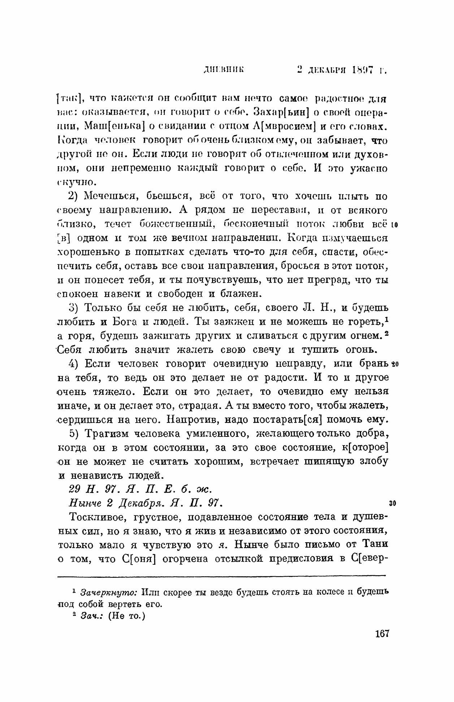

# Tolstoy on "Tolstoyism" (Толстовство)

Date: 2026-05-30

Context: A narrow primary-source dive into where Leo Tolstoy himself uses the label *Tolstoyism* («толстовство») and the word for its followers/movement, *the Tolstoyans* («толстовцы»), across the local corpus — the tolstoydigital TEI texts and the Jubilee Edition (PSS) PDFs. It documents what his own voice does with the terms. It does not adjudicate whether the label is fair.

This is the first of three separate dives that split an earlier combined survey, [tolstoyanism-christian-anarchism](../tolstoyanism-christian-anarchism/index.html): here *Tolstoyism*; then *Christian anarchism* ([christian-anarchism](../christian-anarchism/index.html); Eltzbacher, Sacy, «христианский анархизм»); then *Christian* ([christian](../christian/index.html)). The Christian-anarchism material is deliberately **left for dive #2** — it is not treated below.

---

## 1. Key findings

- **The label is overwhelmingly external.** Of **44** corpus files carrying «толстовц…/толстовств…», only **4** are in Tolstoy's own body voice; in the other ~40 the word belongs to the editors or to third parties. As a label, "Tolstoyism" is mostly something said *about* him, not *by* him.
- **When he uses it, he disowns it.** All four body-voice passages (1894–1909) refuse the label or the movement. The 1897 diary is the plainest: «Никакого толстовства и моего учения не было и нет» — there is no Tolstoyism and no teaching of mine, only the one teaching of the Gospel.
- **The refusal is consistent across fifteen years and three registers** — a blunt "there is no such thing" to a journalist (1894), a private clarification in the diary (1897), and a dry pun to a stranger (1909).
- **One complication.** In 1907 he flinches from the label's *ridicule*, stopping short of advising vegetarianism for fear of it — the name has real social force even with no doctrine behind it.
- **Against the scholarship** (Alston 2013, Maude, Bartlett 2010): the corpus **confirms** the well-known disavowal, **extends** it (an earlier and blunter movement-denial, and the 44→4 count behind "the label was external"), and **complicates** it once (the 1907 ridicule).
- **For the vault.** This dive anchors the `Tolstoyanism` page's flagged "needs primary source" claim and corrects its misattribution of the keystone to "a letter to an adherent" — it is the **1897-12-02 diary** entry (re Makovický). Ingestion is a separate, human step.

---

## 2. Why this matters

A reader who arrives at Tolstoy through twentieth-century commentary meets him already labelled: *Tolstoyism* as the name of a movement, *Tolstoyan* as the name of a follower. Both words were in wide circulation in his own lifetime. The question this dive answers is narrow and checkable: when the words appear in the corpus, **whose voice are they in?**

The answer is the dive's central finding. A keyword sweep for the Tolstoyism family («толстовц…» / «толстовств…») across letters, diaries and works returns **44 files**. Running each through the TEI extractor — which strips the editors' footnotes and leaves only the document's body — the keyword survives in **only 4 of them**. In the other ~40 the term is the editors' or a third party's word, not Tolstoy's: bibliographic references (Prugavin's *О Льве Толстом и о толстовцах*), commentary, letters *about* him. As a label, "Tolstoyism" is overwhelmingly something said **about** Tolstoy; in his own voice it is rare, and almost always a disavowal.

Those four passages are below.

---

## 3. The shape of the question — four disownings, 1894–1909

The four body-voice passages span fifteen years and are strikingly consistent. Working English translations are the editor's; the Russian is verbatim from the TEI, byte-checked against the extract files by `verify_quotes.py` (see Method).

### 3.1 — 1894 (22 September): the movement disowned — to V. N. Mac-Gahan

Letter to Varvara Nikolaevna Mac-Gahan, the Russian-American journalist (PSS Tom 67, pp. 225–227; TEI `v67_231_V_N_Mak_Gaxan`). She had written about "the Tolstoyans" and "the movement raised by my preaching." Tolstoy answers by denying that either exists:

> Вы вот пишете о «толстовцах» и других моих последователях, о движении, поднятом моей проповедью, и о том, почему толстовцы проявляют мало рвения к пропаганде мыслей, которые осчастливят человечество; а я не знаю не только каких-либо других последователей, но и толстовцев

> *You write about "the Tolstoyans" and my other followers, about the movement raised by my preaching, and about why the Tolstoyans show so little zeal in propagating the ideas that would make mankind happy; but I know of no other followers, nor of any Tolstoyans.*

And, a few lines on, the blunt restatement:

> А о толстовцах, движении и т. п. я ничего не знаю, или даже знаю, что этого ничего нет.

> *As for Tolstoyans, a movement, and so forth — I know nothing of it, or rather I know that there is no such thing.*

This is the earliest and the flattest denial of the *movement* in the four — not "I am not its leader" but "there is no such thing." (New to this dive; the earlier combined survey did not surface it.)

### 3.2 — 1897 (2 December): the keystone — the diary, on Makovický

Diary entry at Yasnaya Polyana (PSS Tom 53, pp. 167–169; TEI `v53_167_169_1897_12_02`). Dušan Makovický — the Slovak doctor who in 1910 would be the only physician at Tolstoy's deathbed — had asked how he should act, having "involuntarily become Tolstoy's representative in Hungary." Tolstoy set the answer down that evening:

> Я рад был случаю сказать ему и уяснить себе, что говорить о толстовстве, искать моего руководительства, спрашивать моего решения вопросов — большая и грубая ошибка. — Никакого толстовства и моего учения не было и нет, есть одно вечное, всеобщее, всемирное учение истины, для меня, для нас особенно ясно выраженное в евангелиях.

> *I was glad of the chance to tell him, and to clarify for myself, that to speak of Tolstoyism, to seek my guidance, to ask me to decide questions — is a great and crude error. There was and is no Tolstoyism and no teaching of mine; there is one eternal, universal, world-wide teaching of truth, which for me, for us, is especially clearly expressed in the Gospels.*

This is the plainest denial of the label in the corpus. The «уяснить себе» — "to clarify **for myself**" — is load-bearing: the conversation was only the occasion; the formulation is a private one he gives himself, the same day. A river image follows (once a swimmer reaches the central current there is no longer any guide; all are borne in one direction). The printed page is reproduced below (§7).

### 3.3 — 1907 (1 January): the label as a ridicule — to M. A. Stakhovich

New-Year letter to Mikhail Aleksandrovich Stakhovich (PSS Tom 77, pp. 5–6; TEI `v77_001_M_A_Staxovichu`). Listing the simple abstentions that "open a man to himself," Tolstoy reaches vegetarianism and stops short — not on principle, but for fear of the name:

> …сказал бы, не есть мяса, если бы не боялся ridicul’a толстовства…

> *…I would say, eat no meat — were I not afraid of the ridicule of Tolstoyism…*

Here the label has no doctrine behind it, yet a real social weight: its *ridicule* is strong enough to deflect his own counsel. (In the PSS an editorial footnote marker is printed after *ridicul'a*; it is the editors' apparatus, not part of Tolstoy's sentence.)

### 3.4 — 1909 (4 August): the wry late note — to I. Ivanov

Letter to I. Ivanov (PSS Tom 80, pp. 50–53; TEI `v80_068_I_Ivanovu`). The correspondent had offered, as evidence that people are unkind to one another, that "the Orthodox do not love the Tolstoyans, and the Tolstoyans the Orthodox." Tolstoy faults the premise itself:

> …православные не любят толстовцев, а толстовцы не любят православных. В этом вы, я думаю, ошибаетесь, во-первых, в том, что признаете каких-то толстовцев. Что же до меня касается, то хотя я и сам Толстой…

> *…the Orthodox do not love the Tolstoyans, and the Tolstoyans do not love the Orthodox. In this, I think, you are mistaken — first of all, in that you acknowledge some sort of Tolstoyans. As for myself, though I am Tolstoy myself…*

The objection is to "**some sort of** Tolstoyans (каких-то толстовцев)" existing at all — capped by the pun «хотя я и сам Толстой» ("though I myself am a Tolstoy / a Tolstoyan"). Twelve years after the keystone, the position is unchanged; only the tone has gone dry. (New to this dive.)

---

## 4. Where the theme clusters

### The body-voice finalists (Tolstoy's own voice)

| PSS Tom / pp | TEI id | Date | Addressee | What it does |
| --- | --- | --- | --- | --- |
| Т.67, 225–227 | `v67_231_V_N_Mak_Gaxan` | 1894-09-22 | V. N. Mac-Gahan (letter) | Denies the followers **and** the movement exist. |
| Т.53, 167–169 | `v53_167_169_1897_12_02` | 1897-12-02 | diary (re Makovický) | **Keystone.** "A great and crude error… no Tolstoyism." |
| Т.77, 5–6 | `v77_001_M_A_Staxovichu` | 1907-01-01 | M. A. Stakhovich (letter) | The label as a *ridicule* he flinches from. |
| Т.80, 50–53 | `v80_068_I_Ivanovu` | 1909-08-04 | I. Ivanov (letter) | "Some sort of Tolstoyans… though I am Tolstoy myself." |

Three letters and one diary entry. Genre split: of the four, the letters are answers to other people's use of the word (a journalist, a friend, a stranger); the diary is the one unprompted, self-addressed formulation — which is why it reads as the keystone.

### The reception cluster (the term said *about* him)

The other ~40 files carrying «толстовц…/толстовств…» are **note-only**: the word belongs to the 1928–1958 editors or to third parties quoted in their apparatus, not to Tolstoy. They are the *reception* record, and they are where the label actually lived — e.g. A. S. Prugavin's documentary collection *О Льве Толстом и о толстовцах* (1911), and references to Korolenko and others. They are not entered as evidence here (this dive is Tolstoy's own voice), but they are the natural seam for a separate reception study, and they confirm the asymmetry: the label was overwhelmingly external.

---

## 5. Scholarly context

The conventional scholarly picture and the corpus agree on the core, and the corpus sharpens it in two places.

Every major biographer records the disavowal. Aylmer Maude — who had himself lived at the Purleigh Tolstoyan colony before breaking with its more doctrinaire members — and Rosamund Bartlett (*Tolstoy: A Russian Life*, 2010) both narrate Tolstoy's insistence that "Tolstoyism" was no teaching of his but the Gospel's, alongside the household tension the disciples caused (Sofia Andreyevna's nickname for them, «тёмные», "the dark ones"). Charlotte Alston's *Tolstoy and His Disciples: The History of a Radical International Movement* (I.B. Tauris, 2013) is the first full history of the movement as a real, organised, international phenomenon — colonies in Russia and England, Gandhi's Tolstoy Farm in South Africa, conscientious objection, and the publishing network around Vladimir Chertkov's Free Age Press. The keystone diary (§3.2) is the primary passage this scholarship most often paraphrases; on that point the corpus **confirms** the received view.

The corpus **extends** it in two ways. First, the 1894 Mac-Gahan letter (§3.1) gives an earlier and blunter movement-denial than the usual examples — and to a journalist, exactly the external channel through which the label spread. Second, the sweep makes the standard claim that «толстовство» was a largely external, often pejorative label *quantitative*: 44 files, only 4 in Tolstoy's own voice. Alston is the standard cite for the movement's identity forming partly against that outside label; the corpus supplies the count behind it.

And it **complicates** the tidy "he simply rejected it" in one place. The 1907 Stakhovich letter (§3.3) shows the label with real social force: its *ridicule* actually deflects Tolstoy from prescribing vegetarianism. The name had no doctrinal reality for him and undeniable social reality around him — both at once.

(Alexandre Christoyannopoulos's *Christian Anarchism*, 2010, sits with the [sibling dive #2](../christian-anarchism/index.html), not here.)

---

## 6. Material not covered

- **The «тёмные» ("dark ones").** Sofia Andreyevna's nickname for the disciples was **not** in the keyword sweep — it is a different word, and a `тёмн*` pass would be high-noise ("dark" in every ordinary sense). Left as a targeted follow-up if the household-tension angle is pursued.
- **The ~40 note-only reception files** (Prugavin, Korolenko, editorial commentary) — surfaced as the central finding, not read through as a reception study.
- **Incoming letters.** The TEI corpus holds only outgoing letters; Mac-Gahan's and Ivanov's own letters, which Tolstoy is answering, are not present locally.
- **The conversation transcripts** (Makovický's and Goldenweiser's *Yasnopolianskie zapiski*, 1904–1910) almost certainly carry further spoken disownings; not swept.
- **Christian-anarchism material** (Eltzbacher, Sacy, «христианский анархизм») — deferred to dive #2; held in the legacy combined dive's `extracts/`.
- **The movement's external history** — colonies (Purleigh, Whiteway), Gandhi's Tolstoy Farm, the fate after 1917 — lies outside Tolstoy's own corpus; Alston (2013) is the route.

---

## 7. Visual & manuscript record

The dive is text-first; the visual record is light (single channel — Wikimedia Commons — plus the public-domain facsimile we render ourselves). Provenance, holding and rights for each item are in `dossier.yaml`. The portraits below are downloaded into the git-ignored `visuals/` cache (repopulate a fresh clone with `python3 docs/fetch_visuals.py tolstoyanism`); the facsimile is committed because it is a public-domain rendering of Tolstoy's own text.

<figure>

<figcaption>The keystone. PSS Tom 53 (local <code>vol19</code>), the 2 December 1897 diary page carrying «…Никакого толстовства и моего учения не было и нет…». Rendered at 220 dpi from the local public-domain PSS PDF (<code>extracts/pss-pages/tom53-1897-12-02-205.png</code>).</figcaption>
</figure>

<figure>

<figcaption>Leo Tolstoy at Yasnaya Polyana, 1908 — Sergei Prokudin-Gorsky's colour portrait, the year before the Ivanov letter. Wikimedia Commons, public domain (<em>File:L.N.Tolstoy Prokudin-Gorsky.jpg</em>).</figcaption>
</figure>

<figure>

<figcaption>Vladimir Chertkov, by Ilya Repin (1890s). Not named in the four passages, but the organiser and publisher of the very movement Tolstoy disowns — the human face of the tension between "there is no such thing" and the institution being built in its name. Wikimedia Commons, public domain (<em>File:Repin Vladimir Chertkov.jpg</em>).</figcaption>
</figure>

**Not openly available.** Manuscript facsimiles of the three letters (the diary page aside), and Russian-museum holdings (State Museum of Leo Tolstoy / GMT), were not pursued in this light sweep; they remain a future rights-request item. All four texts map to held local PSS PDFs (Toms 53→`vol19`, 67→`vol33`, 77→`vol39`, 80→`vol57`), so further facsimiles can be rendered locally without a request.

---

## 8. Method

- **Scope (Phase 0 contract, as confirmed).** A fresh, narrow dive on the label «толстовство» and the «толстовцы» movement, **balanced**: the spine is Tolstoy's recoil from the label, with a parallel reading of his ambivalence toward the disciples. Corpus surface: post-1880 "Prophet" period, diaries and letters first-class, works secondary, editorial `comments/` excluded from evidence. Christian-anarchism material left for dive #2.
- **Sweep (Phase 1).** Inline grep over `primary-sources/tolstoydigital-TEI/texts/{letters,diaries,works}` for `толстовц…` / `толстовств…` → **44 candidate files**. Each was classified **body-voice vs note-only** by the decisive test for a label/movement term: run [`extract_tei.py`](../lib/extract_tei.py) (which strips editorial `<note>`s) and check whether the keyword survives. It survives in exactly **4** files — the finalists in §3/§4. (This body-vs-note step is the precision move the sweep turns on: it collapses 44 noisy candidates to 4 real ones.)
- **Extract & verify (Phase 2).** Each finalist was extracted to `extracts/<id>.txt`. Every `quoteRu` in `dossier.yaml` was **sliced directly from those extract files by script** (not hand-typed), then gated by [`verify_quotes.py`](../lib/verify_quotes.py), which asserts each quote appears verbatim in its named extract — **PASS, 5/5**. The keystone page was rendered from the local PSS PDF with `pdftoppm` at 220 dpi.
- **Scholarship (Phase 3).** A light English-first web sweep confirmed the received view and the secondary citations (Alston 2013; Maude 1908–1910; Bartlett 2010; Prugavin 1911), triangulated in §5 and recorded in `dossier.yaml` under `scholarship`.
- **A note on the session.** This dive was run in two sittings. The first reached Phase 1 and was paused mid-Phase-2 when the tool channel began returning plausible-but-fabricated Russian; the work resumed in a clean session trusting only the on-disk extracts and the `verify_quotes.py` gate — which is precisely the safeguard that catches such fabrication. See `session-log.md`.
- **Dates** follow the PSS (Old Style for the pre-1918 Russian items). The TEI filename encodes the PSS Tom and, for diaries, the entry date; both are preserved verbatim so every citation is anchored to its source. Tom→local-PDF lookups are in [pss-volume-mapping.md](../pss-volume-mapping.md).

---

## 9. References

**Primary:**

- Толстой Л. Н. *Полное собрание сочинений: в 90 тт.* — М.: Гос. изд. «Художественная литература», 1928–1958 (PSS, the Jubilee Edition; local copies at `primary-sources/jubilee-edition/`). Tolstoyism-term files concentrated in Toms 53 (diary), 67, 77, 80 (letters).
- tolstoydigital TEI corpus, *Слово Толстого* project, HSE Moscow. CC BY-SA. <https://github.com/tolstoydigital/TEI> (local copy at `primary-sources/tolstoydigital-TEI/`).

**Background:**

- Alston, Charlotte. *Tolstoy and His Disciples: The History of a Radical International Movement.* London: I.B. Tauris, 2013. The first full scholarly history of the толстовцы movement.
- Maude, Aylmer. *The Life of Tolstoy.* 2 vols (*First Fifty Years*, 1908; *Later Years*, 1910). London: Constable. Contemporary biography by a former Purleigh colonist.
- Bartlett, Rosamund. *Tolstoy: A Russian Life.* London: Profile Books, 2010.
- Prugavin, A. S. *О Льве Толстом и о толстовцах.* Moscow: published by the author, 1911. A contemporary documentary collection — an example of the external-reception literature.

**Companion documents:**

- [dossier.yaml](dossier.yaml) — the machine-readable evidence / entity / visuals / scholarship ledger behind this index.
- [extract_tei.py](../lib/extract_tei.py), [verify_quotes.py](../lib/verify_quotes.py) — the shared TEI extractor and the byte-fidelity gate.
- [christian-anarchism](../christian-anarchism/index.html) — dive #2 (*Christian anarchism*).
- [christian](../christian/index.html) — dive #3 (*Christian*).
- [tolstoyanism-christian-anarchism](../tolstoyanism-christian-anarchism/index.html) — the legacy combined survey this dive supersedes for the *Tolstoyism* half.

---

*Dev-blog note (draft):* `website/src/posts/notes/2026-05-30-tolstoyanism.md` — a short recap of this dive, kept `draft: true` until published.
